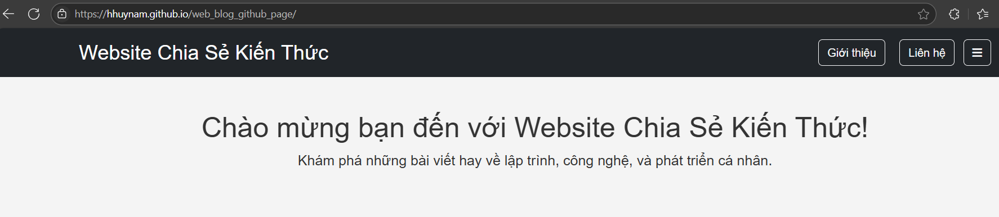

# Đây là web blog cá nhân của tôi, nơi giới thiệu về bản thân, học tập, kinh nghiệm cá nhân, project đã làm

# Tại sao bạn thấy giấy phép MIT trong này?
Tôi sử dụng giấy phép MIT cho dự án Jekyll blog cá nhân này vì tôi muốn:

- Khuyến khích cộng đồng học hỏi và chia sẻ: Mọi người có thể sử dụng, tùy chỉnh hoặc mở rộng mã nguồn blog này để phục vụ nhu cầu cá nhân hoặc dự án của riêng họ.

- Giữ quyền ghi nhận công sức ban đầu: Giấy phép MIT yêu cầu người sử dụng cần giữ lại thông tin bản quyền gốc, từ đó giúp người khác biết ai là tác giả ban đầu.

- Hạn chế ràng buộc pháp lý không cần thiết: Đây là một giấy phép đơn giản, không gây trở ngại cho ai muốn dùng hoặc cải tiến mã nguồn này.
> Tóm lại là vì project này tôi để public, nên tôi muốn người xem biết đến công sức tìm tòi, xây dựng từ đầu của tôi
- Thể hiện tinh thần mã nguồn mở và minh bạch: Mình xây dựng blog này như một nền tảng mở, vì vậy việc công khai mã nguồn kèm giấy phép rõ ràng là điều mình rất coi trọng.
url: https://hhuynam.github.io/web_blog_github_page/
## Cảm ơn đã ghé thăm!
